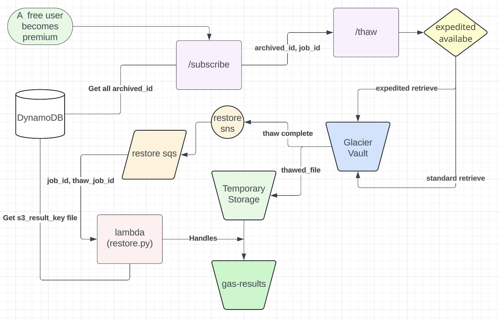

# GAS Framework
An enhanced web framework (based on [Flask](https://flask.palletsprojects.com/)) for use in the capstone project. Adds robust user authentication (via [Globus Auth](https://docs.globus.org/api/auth)), modular templates, and some simple styling based on [Bootstrap](https://getbootstrap.com/docs/3.3/).

Directory contents are as follows:
* `/web` - The GAS web app files
* `/ann` - Annotator files
* `/util` - Utility scripts/apps for notifications, archival, and restoration
* `/aws` - AWS user data files

### A16 Write Up

### Data Restoring Implementation

First, the user upgrades to a premium subscription using the `/subscribe` endpoint in `views.py`. This endpoint retrieves the `user_id` from the session, searches for all archived jobs in DynamoDB associated with that `user_id`, and sends their `job_id` and `archive_id` to the `/thaw` endpoint.

The `/thaw` endpoint, which listens on `http://runqingc-a16-thaw.ucmpcs.org:5002/thaw`, handles the initial step of retrieving an object by making it available for download. Upon receiving a thawing request, it first attempts an expedited retrieval by calling `initiate_job` and setting the 'Tier' to 'Expedited'. If this fails due to an `InsufficientCapacityException`, it falls back to the Standard retrieval approach.

The 'Description' field is set to the `job_id`, which is the primary key in my DynamoDB table, allowing quick and efficient retrieval of related information from the database.

Additionally, I have configured an SNS topic to notify my restore topic "runqingc_a16_restore_requests" once Glacier has thawed the data. This SNS topic then delivers the message to an SQS queue.

A Lambda function handles the second step of the thawing process. It retrieves messages from the queue and uses the `archive_id` and `thaw_job_id` to locate the thawed data in the temporary S3 storage. The `job_id` (wrapped in the 'Description' field) is then used to find the `s3_result_key_file`, which indicates the final location where the file should be restored.

Moreover, I added a `file_restore_status` key in DynamoDB to provide user feedback on the retrieval status. If the expedited retrieval is initiated successfully, the message "File is being restored; please check back later. Your data will be available in a few minutes" is displayed. Otherwise, if the expedited approach fails, the message "File is being restored; please check back later. Your data will be available in a few hours" is shown.

### Some consideration of my design

- Each step of the process (subscription, thawing, restoring) is handled by separate components (`views.py`, `thaw_app.py`, `restore.py`). This modularity makes the system easier to maintain and understand.
- The system gracefully handles errors by attempting expedited retrieval first and falling back to standard retrieval if there is insufficient capacity. This ensures that retrieval attempts are robust and can proceed even when expedited retrieval is not available.

- When using SQS, messages are stored in the queue until they are successfully processed and deleted by the consumer. This means that if a message delivery fails, the message remains in the queue and can be retried. This persistence ensures that messages are not lost even if there are temporary issues with the consumer or processing service.
- SNS alone does not store messages. If a message fails to be delivered to a subscriber, it may be lost unless you configure a dead-letter queue or another retry mechanism.
- Set up automatic scaling policies for Lambda functions and other components to handle varying loads. This ensures the system remains responsive under different conditions.

advantages:

----

### A14 Write Up